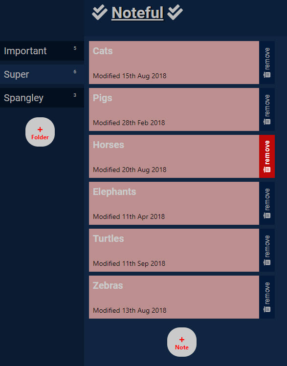

# Noteful-App--React-Assignment

## >> App Summary: 

This app uses a host of React APP techniques. It allows the user to create or remove folder and note items; The folder list is shown at the navigation bar on the left and the Note items list on the right. Users can add and remove folders and notes by using one of the 2 forms(with dynamic validation). A link at the top bring user back to the landing page.

This App is user-friendly and requires minimal network access(beside the fetches). A locally generated server is used to provide data storage for this project.

## >> Screenshot 

## >> Technologies used in this APP:
-> React (in the order of course progression):
* React Router
* Dynamic Routes
* History 
* Context
* Error Boundaries
* PropTypes
* Validators

-> CSS
* Flex and Grid layouts
* Custom Buttons
* FontAwesomeIcons

-> Javascript: API Request: GET, POST, DELETE

-> Javascript: ES6

-> HTML

## >> Github Link: [Github Link](https://github.com/davetam88/Noteful-App--React-Assignment)

## >> SETUP

Getting Started with Create React App.

This project was bootstrapped with Create React App.

Below you will find the available Scripts in the project directory that you can run:

npm start runs the app in the development mode. Open http://localhost:3000 to view it in the browser.

The page will reload if you make edits. Additionally, if there are lint errors, you will see them in the console.

npm test launches the test runner in the interactive watch mode. See the section about running tests for more information.

npm run builds the app for production to the build folder. It correctly bundles React in production mode and optimizes the build for the best performance.

The build is minified and the filenames include the hashes. Your app is ready to be deployed!

See the section about deployment for more information.

npm run eject note is a one-way operation. Once you eject, you can’t go back!

If you aren’t satisfied with the build tool and configuration choices, you can eject at any time. This command will remove the single build dependency from your project.

Instead, it will copy all the configuration files and the transitive dependencies (webpack, Babel, ESLint, etc) right into your project so you have full control over them. All of the commands except eject will still work, but they will point to the copied scripts so you can tweak them. At this point you’re on your own.

You don’t have to ever use eject. The curated feature set is suitable for small and middle deployments, and you shouldn’t feel obligated to use this feature. However we understand that this tool wouldn’t be useful if you couldn’t customize it when you are ready for it.

Learn More

You can learn more in the Create React App documentation.

To learn React, check out the React documentation below.

Code Splitting

This section has moved here: https://facebook.github.io/create-react-app/docs/code-splitting

Analyzing the Bundle Size

This section has moved here: https://facebook.github.io/create-react-app/docs/analyzing-the-bundle-size

Making a Progressive Web App

This section has moved here: https://facebook.github.io/create-react-app/docs/making-a-progressive-web-app

Advanced Configuration

This section has moved here: https://facebook.github.io/create-react-app/docs/advanced-configuration

Deployment

This section has moved here: https://facebook.github.io/create-react-app/docs/deployment

npm run build fails to minify

This section has moved here: https://facebook.github.io/create-react-app/docs/troubleshooting#npm-run-build-fails-to-minify
1